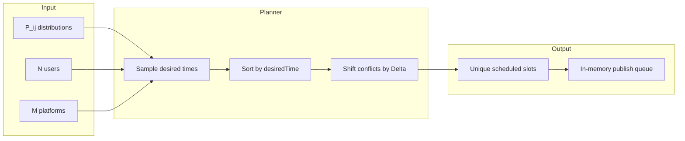

# Social Post Scheduler — Zero-Collision Queueing Strategy

Take-home response to: design a queueing strategy where **P(two users post at the same time) = 0**, given **N** users, **M** platforms, and posting-time distributions **P_ij**.

## Problem statement

- **N** — number of users (`userId ∈ [0, N)`).
- **M** — number of social platforms (`platformId ∈ [0, M)`).
- **P_ij** — probability distribution of user **i**’s *preferred* post time on platform **j** over a day.
- **Collision** — two **distinct** users publish at the same timestamp (global model: one post in flight at a time across the system).

Without a scheduler, each user samples preferred times independently. For continuous or dense discrete distributions, **P(collision) > 0**.

To achieve **P(collision) = 0**, we **discretize** time into slots of width **Δ** (e.g. 1 second) and assign each post a **unique** slot via a deterministic planner.

## Modeling P_ij

**P_ij** describes when user **i** would naturally post on platform **j** during a day. We decompose it into:

1. **p_ij** — probability that user **i** posts on platform **j** today (`postProbability[i][j]`).
2. **f_ij(t)** — PDF over time-of-day on `[0, daySeconds)` if a post happens (`timeDistribution[i][j].sample()`).

Joint model:

```
P_ij(time = t and post occurs) = p_ij · f_ij(t)
```

Sampling in code: draw `post ~ Bernoulli(p_ij)`; if true, draw `desiredTime ~ f_ij`. Implementations include `gaussianPeak` (per-platform peaks), `uniformDay`, and `buildCongestedIntentMatrix` (shared noon peak for stress demos).

## Why unscheduled posting fails

If user A and user B each pick a random second in `[0, 86400)`, the chance they pick the same second is non-zero (roughly `1/86400` per pair per attempt, and higher with more users and multiple platforms). Real platforms also have API bursts when many clients post “naturally” at peak hours. A queueing layer is required to enforce spacing.

## Proposed strategy: EDCR

**EDCR (Earliest-Deadline Conflict Resolution)** — sort post intents by preferred time, then assign each intent the earliest feasible slot that respects a global minimum gap **Δ**.



### Pseudocode

```
intents = []
for each user i, platform j:
  if random() < postProbability[i][j]:
    intents.append({ i, j, desiredTime ~ P_ij })

sort intents by (desiredTime, userId, platformId)
occupied = empty set
lastScheduled = -Δ

for intent in intents:
  t = max(intent.desiredTime, lastScheduled + Δ)
  while t in occupied:
    t += Δ
  schedule intent at t
  occupied.add(t)
  lastScheduled = t
```

**Complexity:** `O(K log K)` for `K` intents (sort dominates).

### Correctness sketch

After scheduling, all `scheduledTime` values are distinct and consecutive scheduled times differ by at least **Δ** (monotonic `lastScheduled`). Two different users cannot share a slot, so under this discrete-time model **P(collision) = 0**.

If no slot remains before `daySeconds`, the planner throws `SchedulingError` (day capacity exceeded).

## Publish queue

After EDCR, scheduled posts enter a **`PublishQueue`** ([`src/queue.ts`](src/queue.ts)) ordered by `scheduledTime`:

- `peekDue(now)` — posts ready to publish at or before `now`
- `dequeue(post)` / `drainDue(now)` — publisher removes handled items

In production this maps to a **Redis ZSET** (score = `scheduledTime`), **SQS delay queue**, or **Kafka** with time-ordered consumption. The queue enforces *when* to publish; EDCR enforces *no two users at the same second*.

## System design (production sketch)

| Component | Role |
|-----------|------|
| **Intent service** | Once per day (or on user action), sample whether each `(i, j)` posts and draw `desiredTime ~ P_ij`. |
| **Planner** | Stateless EDCR run over intents; idempotent key `dayId` + intent hash for replay. |
| **Delay queue** | Redis ZSET / SQS / Kafka keyed by `scheduledTime`; publisher pops due items. |
| **Publisher worker** | Single global worker ⇒ strongest collision guarantee; **M** per-platform workers ⇒ higher throughput but only per-platform guarantees unless coordinated. |

```
[Intents] --> [Planner EDCR] --> [Delay Queue] --> [Publisher] --> [Platform APIs]
```

## Trade-offs

### Fidelity vs safety

The scheduler enforces a minimum gap **Δ** between any two posts. This drives collision probability to zero in a discrete-time model, but every conflict resolution pushes at least one post away from its sampled preferred time. Tuning **Δ** trades how closely we honor **P_ij** against API rate limits and “bot-like” posting patterns.

### Global vs per-platform scheduling

| Approach | Collision guarantee | Throughput |
|----------|---------------------|------------|
| **Global EDCR** (this repo) | No two users collide anywhere | Single publish pipe |
| **Per-platform EDCR** | No collision on same platform | M parallel publishers |
| **No scheduler** | P(collision) > 0 | Maximum “natural” throughput |

### Delay cost

The CLI reports `avgDelay` and `maxDelay` (seconds between `desiredTime` and `scheduledTime`). Large delays mean UX drift from habits encoded in **P_ij**.

### Fairness

EDCR processes earlier `desiredTime` first; users with late peaks absorb more shifts. Mitigations: **weighted fair queueing (WFQ)**, per-user max delay caps, or round-robin tiers.

### Scalability

In-process planner is `O(K log K)`. For large `N × M`, batch by hour-of-day shard, or pre-compute daily plans offline.

### Operational risks

- **Planner crash** — replay from stored intents (idempotent).
- **Duplicate publish** — idempotency key `(userId, platformId, day, slot)`.
- **Day capacity exceeded** — `SchedulingError` when `K · Δ` exhausts the day window; requires splitting across days or raising **Δ**.

### Scope (2-hour take-home)

This repository implements in-memory scheduling and a simulation CLI. It intentionally omits real Kafka, distributed locks, and multi-region deployment.

## Alternative strategies

| Strategy | P(collision) = 0 | Pros | Cons |
|----------|------------------|------|------|
| **EDCR** (implemented) | Yes (discrete slots) | Stays close to P_ij | Needs occupied-slot state |
| **Global FIFO mutex** | Yes | Simplest | Large drift from P_ij |
| **Round-robin by user** | Yes | User fairness | Ignores peak hours in P_ij |
| **Per-platform EDCR** | Per platform | Parallel publish | Global collisions possible |
| **Weighted fair queueing** | Yes | Fairness + fidelity | More complex weights |

## Demonstrations

The CLI runs two scenarios:

| Scenario | N × M | Purpose |
|----------|-------|---------|
| **normal** | 5 × 3 | Spread platform peaks — often low delay |
| **congested** | 20 × 2 | All posts target noon (`desiredTime = 43200`) — **avg/max delay** visible, `collisions` stay 0 |

```bash
npm run dev                 # both scenarios
npm run dev -- congested    # congested only
npm run dev -- normal       # normal only
```

Congested output sorts by delay (desc) so fidelity vs safety trade-off is visible.

## How to run

```bash
npm install
npm test
npm run dev
```

`npm test` — 12 tests including 100-intent property, congested delay, `PublishQueue`, and `SchedulingError`.

Build and run compiled output:

```bash
npm run build
npm start
```

## Project layout

| File | Purpose |
|------|---------|
| `src/types.ts` | Core types and config |
| `src/distributions.ts` | Mock **P_ij** (`gaussianPeak`, `uniformDay`, congested matrix) |
| `src/scheduler.ts` | `generateIntents`, `schedulePosts` (EDCR), `SchedulingError` |
| `src/queue.ts` | `PublishQueue` — ordered delayed publish |
| `src/simulate.ts` | Demo CLI (normal + congested) |
| `src/scheduler.test.ts` | Scheduling guarantees |
| `src/queue.test.ts` | Queue due/dequeue behavior |

## Future work

- Timezone-aware **P_ij** and DST edges.
- Dynamic reschedule when a user cancels or edits a draft.
- Online replanning when new intents arrive mid-day.
- Compare EDCR vs WFQ on replayed production traces.
